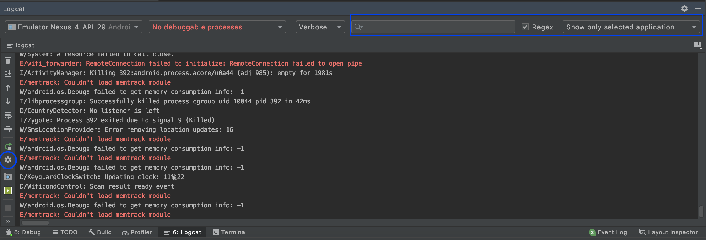
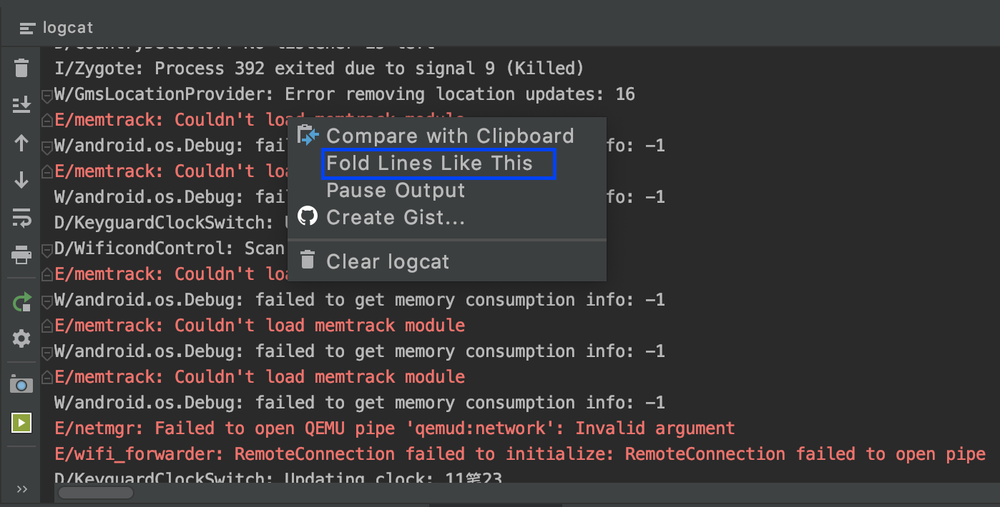
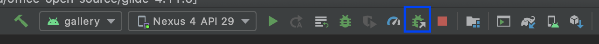
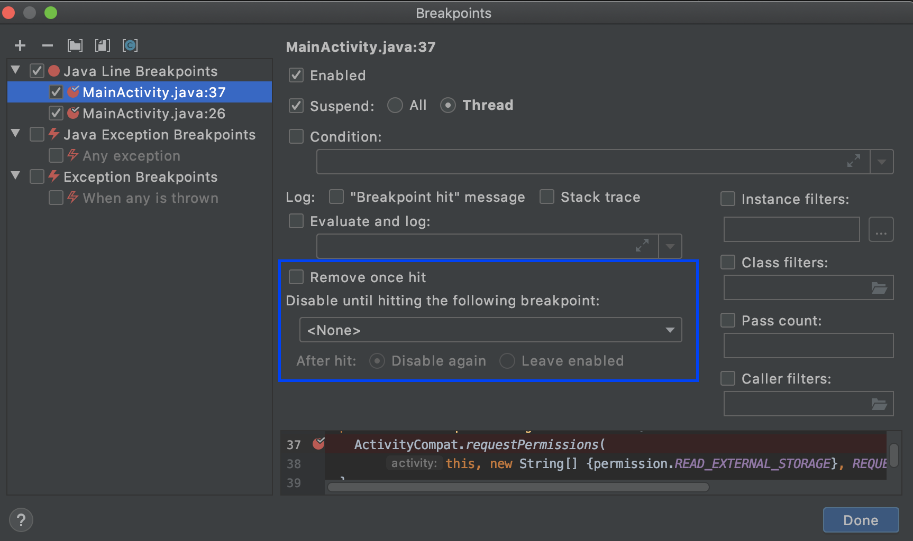
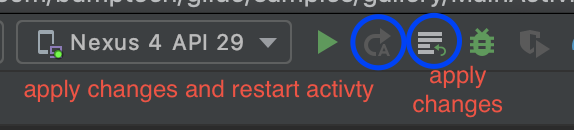

!!! tip
    程序员花在调试bug的时间要远多于写代码的时间，因此掌握一些有用的debug技巧，能有助于我们更快地找出bug，进而解决bug。Google在Android Dev Summit2019上介绍了Android studio的debug技巧。在此记录下利用Android studio调试的几个tricks。Google微信号相关文章。

    - [小技巧 | 在 Android Studio 调试应用 (上)](https://mp.weixin.qq.com/s/kZGM2vgSmxdyTKPqm1J3XA)
    - [小技巧 | 在 Android Studio 调试应用 (下)](https://mp.weixin.qq.com/s/vAi1R8hkWqJpwYTHuFkmBw)

## Log的过滤与折叠
### Log的过滤
- 精简每条Log的输出，例如Log中不显示时间信息等。点击图中圆形框内的设置按钮，即可调出设置界面。
- 通过设置过滤条件，来筛选符合条件的Log

### Log的折叠

## 在当前进程附加调试器
对于一个已经运行的进程，不需要重新点击debug按钮进入调试模式，而可以点击**附加debug到当前进程**按钮，进入debug模式。

## 断点的操作
### 移动断点
长按已经设置好的断点，然后可以拖拽到任何想要的位置。

### 条件断点
右键断点，可以设置任何触发断点的条件。在未符合套件时，断点不会被触发。但是也会发生异常情况，在没有符合断点触发条件下触发了。暂时不知道什么原因。

### 依赖断点
也就是触发某个断点，需要满足在前面一个断点触发后才能触发。设置如图所示：

### 记录与评估
可以输入需要记录的某个变量的值，设置界面跟上一个见面一样，只是是在`Evaluate and Log`中输入。

### 禁用断点
右键断点，enabled取消即可

### 断点分组
可以选择一系列断点，分为一个组，可以同时enable和disable。以便下次调试的时候重新开启。同样也是在断点界面进行操作。右击选中的断点，并选择 Move to group 接下来  Create new 并为新的分组命名。

## 其他更方便的操作
### Drop Frames
在Android10以及以上的机器上，当错过了进入某个方法的时机，点击`drop frame`按钮，可以有再次进入该方法的机会。只是如果类的状态已经改变了，其中显示的也是变化后的类的状态。并不是“时间机器”。

### 评估表达式（Evaluate Expression)
可以更自由的探索代码中变量的值。具体的截图使用见[小技巧 | 在 Android Studio 调试应用 (下)](https://mp.weixin.qq.com/s/vAi1R8hkWqJpwYTHuFkmBw)

### Apply changes
不需要停止debug，动态更新已经更改的地方。与drop frame配合使用，能达到意想不到的效果。具体截图示例，依旧是见[小技巧 | 在 Android Studio 调试应用 (下)](https://mp.weixin.qq.com/s/vAi1R8hkWqJpwYTHuFkmBw)

### 分析堆栈信息
对于在debug之外，程序运行时报出的bug堆栈信息，将其复制到对应项目的 `Analyze 菜单中的 Analyze Stack Trace or Thread Dump 将这些信息转化为有意义的内容`。