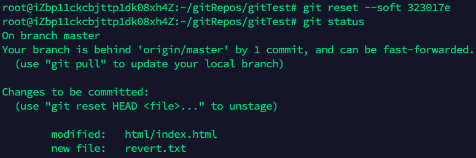
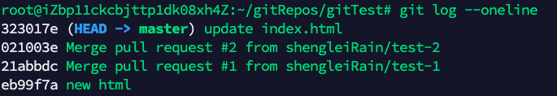

## 概述

Git是当前最为流行的分布式版本控制系统（Distribute VCS），具有VCS所共有的优点：

- 能够记录每个文件所有的历史版本
- 能创建分支和合并分支
- 可以追踪每一次更改

Git相比较于其他版本控制系统（CVS或者SVN），每个开发者的代码副本也包含了所有更改的完整记录，而CVS或者SVN只有一个地方拥有所有历史版本的记录。另外，作为分布式系统，Git具有以下优点：

- 性能
- 安全性
- 灵活性

以下在GitHub上创建一个私有仓库，来熟悉git的基本命令。

## 创建

### git init

在本地文件夹中，初始化一个git仓库

```
cd [本地的文件夹]
git init
```

### git remote add

与远程仓库绑定

```
git remote add origin https://github.com/shengleiRain/gitExercise.git
```

### git clone

直接将远程仓库中克隆到本地，[获得更多git clone相关](https://www.atlassian.com/git/tutorials/setting-up-a-repository/git-clone)

```
git clone https://github.com/shengleiRain/gitExercise.git
```

## 配置

### git config

可以`--global`和`--local`设置，通常设置：

```
git config --global user.name ""
git config --global user.email ""
```

[更多git config相关信息](https://www.atlassian.com/git/tutorials/setting-up-a-repository/git-config)

### git alias

给git命令设置更短的别名

```
git config --global alias.co checkout
git config --global alias.br branch
git config --global alias.ci commit
git config --global alias.st status 
```

## 添加和提交

### git add

将新添加或者修改了的文件，加入到提交清单中

```
git add --all
git add <file/dir>
```

### git commit

提交到本地仓库，后续还可以通过`git push`推到远程仓库中。

```
git commit -m ""
```

## git stash

这个命令是将没有的提交的内容，但暂时又不想提交的内容保存到堆栈中。

### 应用场景

- 当开发人员正在dev分支上进行开发，但是现在线上发生了bug，而dev分支上的更改暂时又不想提交，那么可以使用`git stash` or `git stash save`暂存dev分支更改的内容，切换到bug修复分支。修复完成后，切换到dev分支接着进行开发，`git stash pop`恢复内容
- 在本应该在dev分支上进行的修改操作，却在另一分支上进行，这时候可以`git stash`，切换到dev分支，`git stash pop`恢复即可

总的来说，`git stash`可以暂存修改内容，然后恢复到任意分支上。

| 命令              | 作用                                      |
| ----------------- | ----------------------------------------- |
| git stash         | 暂存修改未提交内容                        |
| git stash save "" | 同上，添加一些comment                     |
| git stash pop     | 在当前分支恢复stash暂存内容，可以指定Key  |
| git stash list    | 显示所有暂存stash列表                     |
| git stash apply   | 不会删除stash内容，可以应用到多个分支     |
| git stash clear   | 清除堆栈                                  |
| Git stash show    | 查看对战中最新保存的stash和当前目录的差异 |

## 比对文件的不同

### git diff

- `git diff`会比对更改却未提交所有文件的不同之处

## 查看状态

### git status

列出文件的状态

### git log

查看所有commit的信息

| 参数     | 示例                        | 解释                      |
| -------- | --------------------------- | ------------------------- |
| -n       | git log -10                 | 显示最新的10条log         |
| --after  | git log --after 2020-01-01  | 显示在2020-01-01之后的log |
| --before | git log --before 2020-02-02 | 显示在2020-02-02之前的log |
| --author | git log --author="rain"     | 显示作者为rain的log       |
| --grep   | git log --grep="Hot-"       | 显示消息中有Hot-的log     |

### git blame

显示某个文件具体到行的修改记录

```
git blame README.md
```

## 撤销

### 撤销本地的改变git revert and git reset

| 命令       | 描述                                                         |
| ---------- | ------------------------------------------------------------ |
| git revert | 不同于传统意义上的撤销操作，这个“undo”操作后会记录一次相反的操作，以免丢失记录。演示如图：<br/> |
| git reset  | 有三种模式可供选择（默认为mixed）：<br/><br/>--soft：只重置HEAD到选择的提交处，效果类似于`git checkout <commit #>`，但不会是处于**detached** HEAD状态<br/><br/><br/><br/>--mixed：重置HEAD到选择的commit处，history和index都重置<br/>--hard：重置history、index和工作区的改变<br/> |

> **参考文章**：[Git reset三种模式，这篇文章对git的三个区域以及reset的三种模式解释得很清楚](https://www.jianshu.com/p/c2ec5f06cf1a)

> **detached HEAD状态**：所做的任何更改不会影响现在的状态，会被git回收掉。但是可以通过新增一个分支，来保留这些改变。

### 检视某个历史提交版本

- 通过`git log --oneline`可以看到当前分支的提交版本
- 通过`git checkout <hash id>`可以切换到历史提交版本，该状态为***detached HEAD***。所做的任何更改不会影响现在的状态，会被git回收掉
- 最后通过`git checkout master`切换回当前分支最新状态

### 撤销最后一次提交，新增更多的改变

这种情况我理解是，当提交了版本之后，发现该版本还存在需要补充或者撤销的地方，那么直接修改后，用`git commit -amend`重新提交最后一次版本。

### git clean

清除untracked文件或文件夹

>`git reset`和`git revert`都能撤销一些提交版本，他们的差异在于，`git revert`后保留撤销前的版本，而`git reset`不会。因此，`git revert`更加安全，推荐在与远程仓库交互时采用这种方式。

### git rm

针对tracked文件或文件夹，可以理解为`git add`的反操作

> `rm`和`git rm`的区别，当用`rm`操作tracked文件时，git会记录delete这个文件的动作，但是不会将这个改变add进去git工作区。`git rm`相当于合并了这两个操作。


