## 概述

本文介绍几个重写或者修改git历史（即commit之后的记录）的方式，并且讨论它们的优点和缺点。提供这些重写历史方式的原因在于：**尽可能地不丢失提交更改记录**。

- git commit --amend
- git rebase
- git reflog

## git commit --amend 改变最后一次提交

`git commit --amend`是用来修改最后一次提交记录。可以用于：

- 将新增的stage区域改变和上一次提交合并，而不需要新建一次提交记录；
- 更改上一次提交的comment信息。

| - stage区域有新增的改变信息 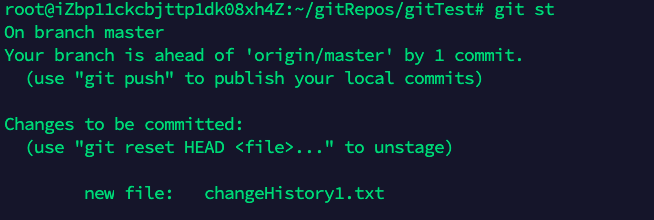 |      |
| ------------------------------------------------------------ | ---- |
| **- git commit --amend之后，并没有新增新的提交信息** 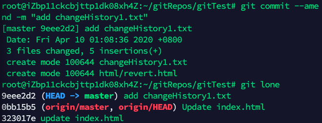 |      |

> ⚠️当不需要修改comment时，加上`--no-edit`
>
> 不要在别人提交的历史基础上修改，会造成迷惑行为！

## git rebase 更改更老的提交历史或者多个提交历史

可以使用`git rebase`将一系列提交记录组合到一个新的提交中。专门将更改从一个分支集成到另一个分支上，能更改提交历史。

> ⚠️不要`git rebase`已经提交到public仓库中的历史。

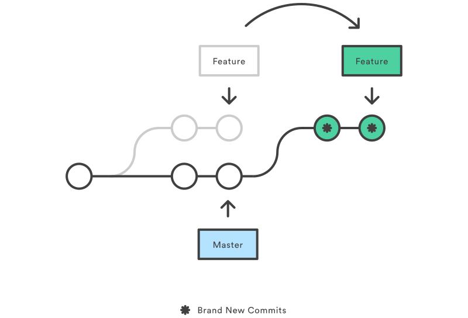

> `git rebase`从内容表达上来看，看起来像在另一个分支上创建了一次新的提交。

### 一个git rebase 示例

目前有两条分支，一条是master，另一条是new_branch。`git lone`代表`git log --oneline`

| 示例：git rebase                                             |
| ------------------------------------------------------------ |
| - new_branch分支的状态 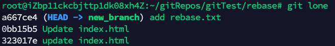 - master分支的状态 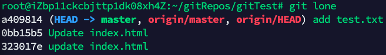 - 切换到new_branch分支，然后rebase，可以看到new_branch分支新提交的内容，和master分支的新提交内容到了同一条线上 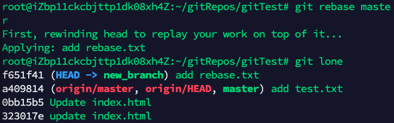 - 切换到master分支上，merge 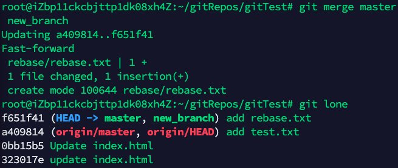 |

[更加清晰的示例](http://gitbook.liuhui998.com/4_2.html)

### git rebase -i 示例

| 合并几个commit，git rebase -i [HEAD~n]                       |      |
| ------------------------------------------------------------ | ---- |
| - 当前log状态 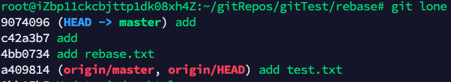 - git rebase -i 参数信息 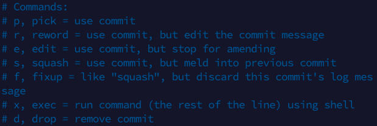 - 合并后的log状态 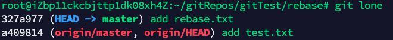 |      |

## 查看所有分支的历史，包括已经删除的commit记录和reset记录 git reflog

用来记录所有分支的更新操作，一般的操作包括：

- git checkout
- git reset
- git merge
- git stash

reflog存储在本地仓库中，存储目录包括：

- `.git/logs/refs/heads/.`
- `.git/logs/HEAD`
- `git/logs/refs/stash`

一些具体使用，可以参见：[git-reflog](https://www.atlassian.com/git/tutorials/rewriting-history/git-reflog)

- 根据分支名称显示：`git reflog master@{0}`
- 根据HEAD显示：`git reflog HEAD@{0}`
- 根据stash记录显示：`git reflog stash`
- 根据时间来显示：`git reflog master@{1.minute.ago}`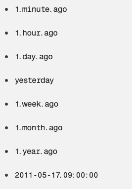

> 对于reflog，可以比对两个reflog的差异，例如`git diff stash@{0} otherbranch@{0}` 

### 给reset --hard一个后悔药

| 示例--恢复reset的记录                                        |
| ------------------------------------------------------------ |
| - git reset --hard  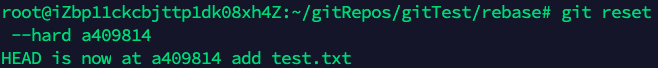 - reset之后的log 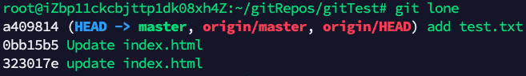 - 想要恢复reset的内容，`git reflog`查看reset commit ID 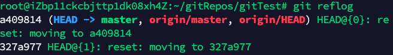 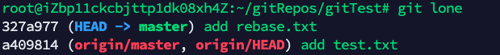 |

> ⚠️reflog存在过期时间，默认为90天。