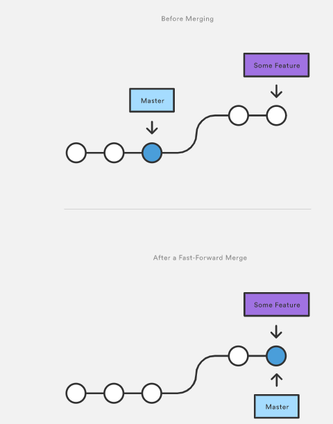
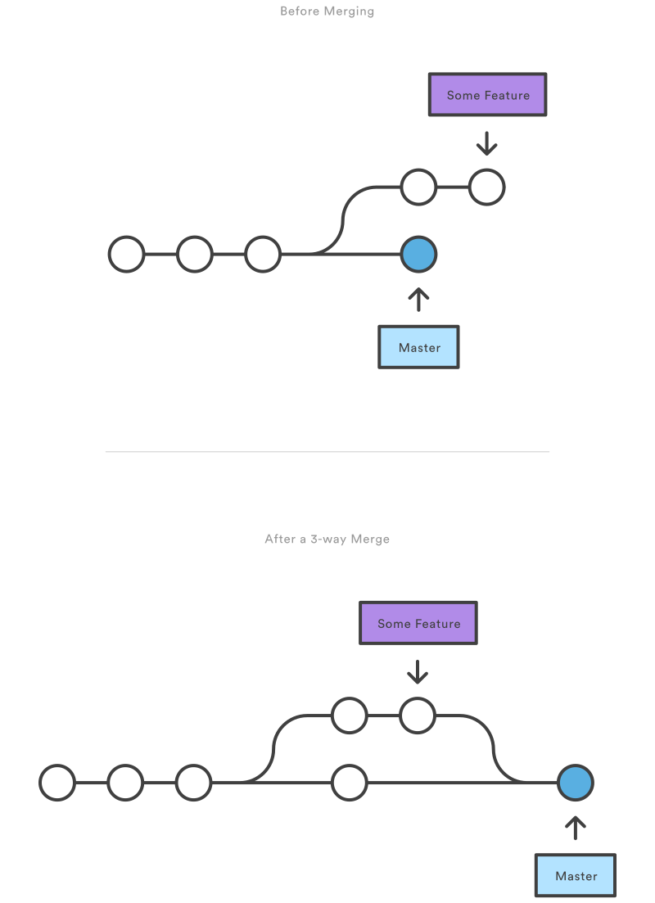
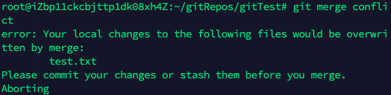
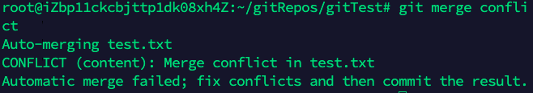
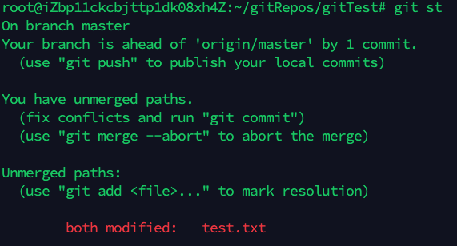
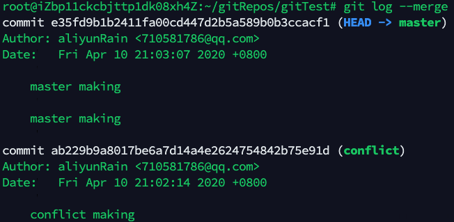

## git branch

分支代表着一条独立的发展方向，有着属于自己的**工作空间（working directory）**、**暂存区（staging area）**和**历史记录（project history）**。

`git branch`可以创建、列表显示、重命名和删除分支。

| 命令                            | 作用                                           |
| ------------------------------- | ---------------------------------------------- |
| git branch \<branch>            | 新建本地分支\<branch>                          |
| git remote add \<branch> \<url> | 创建远程分支\<branch>                          |
| git branch [--list]             | 当前本地仓库中的分支列表                       |
| git branch -d \<branch>         | 安全地删除分支，如果有unmerged变更，会阻止删除 |
| git branch -D \<branch>         | 强制删除分支，不管有没有unmerged变更           |
| git branch -m \<branch>         | 重命名当前分支为\<branch>                      |
| git branch -a                   | 将本地分支和远程分支都列表出来                 |
| git branch -r                   | 将远程分支列表出来                             |

## git checkout

`git checkout`	用来切换分支或者切换到某次提交处。

| 命令                                                | 作用                                                    |
| --------------------------------------------------- | ------------------------------------------------------- |
| git checkout \<branch>                              | 切换本地HEAD为本地分支\<branch>                         |
| git checkout -b \<branch>                           | 效果相当于`git branch <branch>`+`git checkout <branch>` |
| git checkout -b \<branch> \<old_branch>             | 分支的建立依托于\<old_branch>，其他同上                 |
| git checkout \<remotebranch> origin/\<remotebranch> | 新建基于远程分支的本地分支                              |

## git merge

将两个分支的内容，合并到一个分支里面。通常`git merge`与`git checkout`联合起来用。

| 命令                                                      | 作用                                                         |
| --------------------------------------------------------- | ------------------------------------------------------------ |
| git checkout \<receivebranch> git merge \<mergebranch> | 切换到\<receivebranch>分支 将\<mergebranch>分支的内容合并到\<receivebranch>分支 |

### 快速合并（fast forward merge）

当目标分支和需要合并的分支在同一条线上，那么可以**快速合并**。

### 3-way merge

当两个分支共祖先，并不在一条直线上的时候，那么需要新建一个merge提交记录，并且解决可能存在的冲突问题。

## 合并冲突（Merge Conflict）

### 冲突的种类

- merge开始的时候出错：工作区或者暂存区还有变更没有提交。
- 在merge过程中出错：系统无法判别两个版本之间怎么取舍。

### 如何识别出冲突发生的位置

| 命令              | 作用                                                         |
| ----------------- | ------------------------------------------------------------ |
| git status        | 看发生冲突的文件信息  |
| git log --merge   | 列出冲突的两个commit的log信息  |
| git diff          | 列出冲突的不同之处                                           |
| git merge --abort | 终止本次merge，回到merge开始之前的状态                       |

## 合并策略（Merge Strategies）

[合并策略CSDN解释](https://blog.csdn.net/WPwalter/article/details/87904154)

[合并策略Bitbucket解释](https://www.atlassian.com/git/tutorials/using-branches/merge-strategy)

| 策略      | 示例和解释                                                   |
| --------- | ------------------------------------------------------------ |
| Recursive | `git merge -s recursive branch1 branch2` 默认的两个分支的合并策略，可以检测和处理涉及重命名的合并，但是对于冲突无法自动解决 |
| Resolve   | `git merge -s resolve branch1 branch2`                   |
| Octopus   | `git merge -s octopus branch1 branch2 branchN` 默认的多分枝合并策略 |
| Ours      | `git merge -s ours branch1 branch2 branchN` 冲突的地方全部接受目标分支 |
| subtree   | `git merge -s subtree branch1 branch2`                   |

