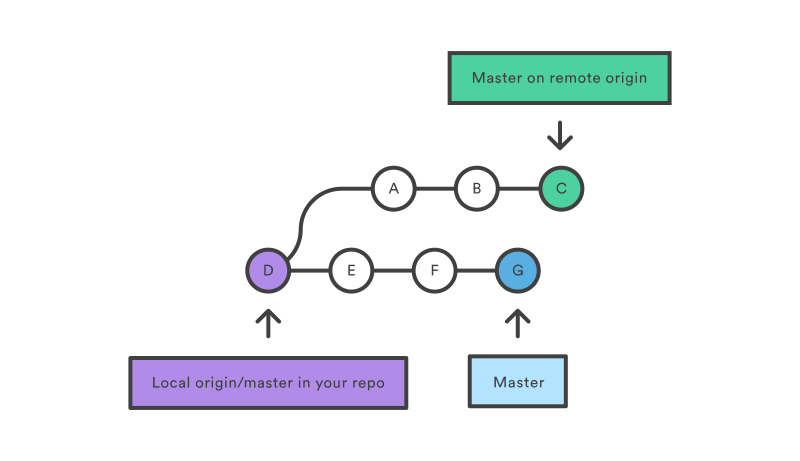
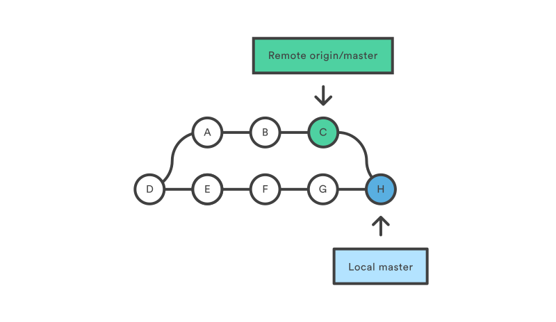
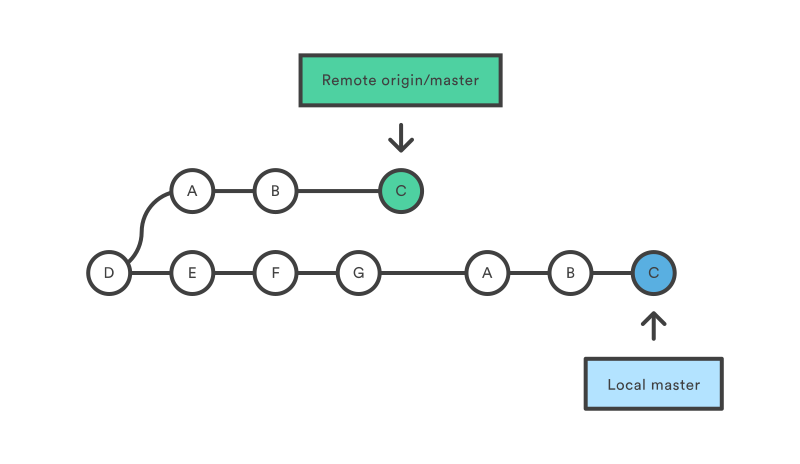
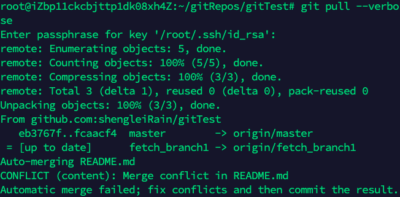

## git fetch

`git fetch`是用来从远程仓库中下载commits、files和refs到本地仓库中。可以将远程仓库所有人已经做好的commits变更都下载到本地仓库上。与`git pull`相比，**`git fetch`不会立即将更改merge，不会改变本地仓库的工作状态，使本地仓库保持不变。需要手动调用git merge，并且解决可能出现的merge冲突。**

| 目录                 | 作用                             |
| -------------------- | -------------------------------- |
| ./.git/objects       | 存储所有提交历史版本             |
| ./.git/refs/heads/   | 本地分支，对应HEAD指向的历史版本 |
| ./.git/refs/remotes/ | 远程分支，对应HEAD指向的历史版本 |

## git pull

`git pull`本质上是将`git fetch`和`git merge`两个操作合并了起来，先`git fetch`，然后`git merge`。一个新的merge提交会被创建，并且**HEAD**会指向这个新创建的提交。

### 一个示例

| 假定远程仓库和本地仓库的版本关系是如下图：  |
| ------------------------------------------------------------ |
| - git pull后会创建一个merge版本  |
| - 使用git pull --rebase后，[git rebase](#git-rebase-更改更老的提交历史或者多个提交历史) 可以通过配置`git config --global branch.autosetuprebase always`让`git rebase`替代`git merge`  |
| - git pull --verbose 会显示具体的merge信息。 |

