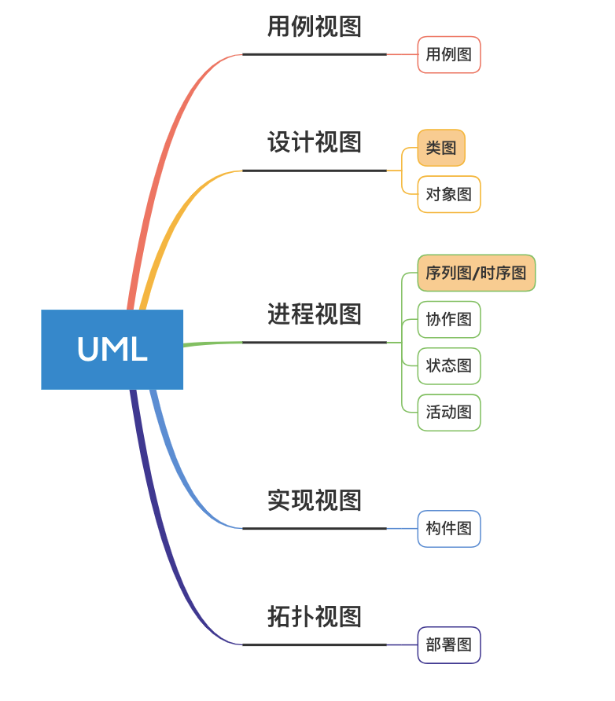
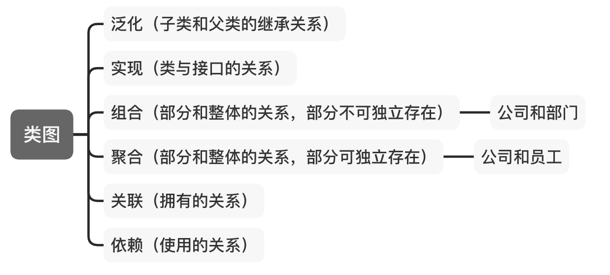
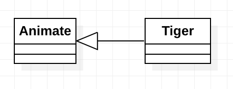

## UML中的九种图

## 类图
类图是用来描述类与类之间的关系，是一种静态结构图。其中包含有6种关系：泛化、实现、组合、聚合、关联和依赖。

### 泛化
用来指代子类和父类之间的关系。子类继承了父类的特征和行为，在Java语言种就是继承了父类的所有非私有成员变量和方法。图例表示是，子类指向父类，空心的三角箭头。

### 实现
用来指代类和接口（或者抽象类）之间的关系。用虚线空心三角箭头表示。

### 组合
组合是比聚合更强的关联关系，在代码中的体现是成员变量。用实心菱形和箭头表示，实心菱形指向整体，箭头指向部分。

### 聚合
聚合关系是关联关系的一种，从语法上无法区分，必须考察具体的逻辑关系。用空心菱形和箭头表示，空心菱形指向整体，箭头指向部分。

### 关联
包括双向和单向的关联。双向用双向箭头（或者没有箭头的直线）表示，单向用单向箭头表示。

### 依赖
一个类需要使用另一个类，尽量不要使用双向依赖。用带箭头的虚线表示。
!!! note 
    具体的图示，以后在分析源码的时候展示。starUML对于每一个关系的表示，都提供了对应的图例，不需要死记，尽量在以后的使用中熟悉。

## 序列图
描述对象之间消息发送的先后顺序，强调时间顺序。

## 参考链接
[UML知乎](https://zhuanlan.zhihu.com/p/44518805)
